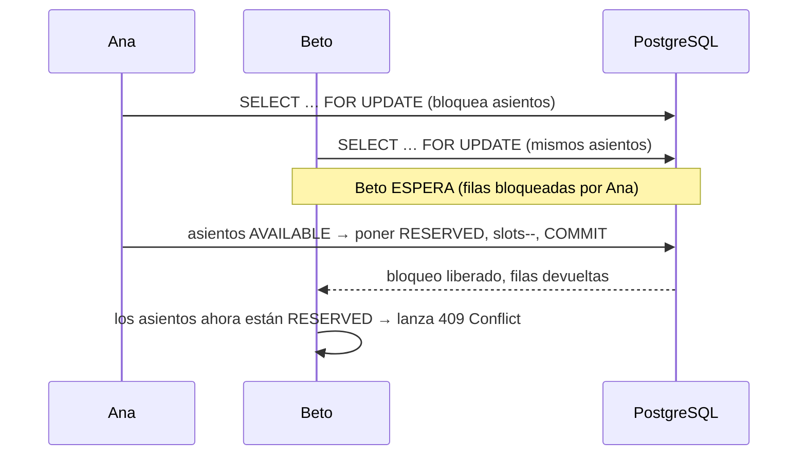

# Concurrencia y Bloqueo

> [!summary]
> El problema más difícil en una app de boletos es **dos personas intentando comprar el mismo asiento en el mismo instante**. SwiftEntry lo resuelve con dos defensas complementarias: un **bloqueo pesimista** cuando los asientos se apartan por primera vez (la reserva), y un **bloqueo optimista** (`@Version`) que atrapa cualquier carrera restante. Esta página explica ambos en palabras simples — es el detalle más importante del código.

---

## 1. El problema (intuición)

Imagina el último asiento VIP. Dos compradores, Ana y Beto, ambos hacen clic en "reservar" en el mismo milisegundo. Sin protección, ambos hilos leen "el asiento está AVAILABLE", ambos escriben "RESERVED", y ahora un asiento se vendió dos veces. Eso es una **condición de carrera**.

Lo prevenimos en dos capas, como una puerta con cerrojo y cadena a la vez.

---

## 2. Defensa #1 — Bloqueo pesimista al momento de reservar (el cerrojo)

Cuando se crea una [[Reserva]], el servicio **no** lee los asientos de forma normal. Llama a una consulta especial del repositorio:

```java
// LocalitySeatRepository
@Lock(LockModeType.PESSIMISTIC_WRITE)
@Query("SELECT ls FROM LocalitySeatModel ls JOIN FETCH ls.locality JOIN FETCH ls.seat WHERE ls.id IN :ids")
List<LocalitySeatModel> findAllByIdWithLock(List<Long> ids);
```

`PESSIMISTIC_WRITE` le dice a PostgreSQL: **"bloquea estas filas de asientos — `SELECT … FOR UPDATE`."** Cualquier otra transacción que intente bloquear las mismas filas tiene que **esperar en fila** hasta que la primera transacción termine. Así que la petición de Ana toma las filas, verifica que estén `AVAILABLE`, las marca `RESERVED` y hace commit. Solo entonces la petición de Beto obtiene las filas — y ahora ve `RESERVED` y es rechazada limpiamente con un `409 Conflict`.

> [!note] ¿Por qué "pesimista"?
> Asume que un choque *va a* ocurrir y bloquea por adelantado. Es la garantía más fuerte, que es exactamente lo que quieres en el momento en que se apartan los asientos. El `JOIN FETCH` además trae la localidad y el asiento en la misma consulta para evitar viajes extra.

---

## 3. Defensa #2 — Bloqueo optimista en todo lo demás (la cadena)

Tanto [[Localidad]] como [[Asiento|LocalitySeat]] llevan una columna `@Version`:

```java
@Version
private Long version = 0L;
```

Hibernate incrementa automáticamente `version` en cada update y añade `WHERE version = <el valor que leí>` a cada `UPDATE`. Si alguien más cambió la fila mientras tanto, el update afecta **0 filas**, y Hibernate lanza `OptimisticLockingFailureException`.

Esa excepción la atrapa de forma central el [[Infraestructura Compartida|GlobalExceptionHandler]] y se devuelve como un `409 Conflict` amigable: *"El recurso fue modificado por otra transacción. Intenta de nuevo."*

Esto protege updates que no pasan por el camino pesimista — ej. dos [[Pago|pagos]] compitiendo por asientos que se traslapan, o ediciones concurrentes a los contadores de cupos de una localidad.

---

## 4. Defensa #3 — Re-verificar dentro de la transacción (cinturón y tirantes)

El flujo de [[Pago]] revalida deliberadamente **dentro** de la transacción que hace commit (`PaymentExecutor.execute`), no solo en la entrada:

- Re-confirma que la reserva siga `PENDING`.
- Re-confirma que la reserva no haya expirado.

Esto cierra la diminuta ventana entre la verificación externa (en `PaymentServiceImpl`) y la escritura real a la base de datos. Si la re-verificación falla, la transacción hace rollback limpio y no se escribe nada. Ver [[Pago]] para la historia completa de por qué el pago se divide en dos beans.

---

## 5. `availableSlots`: un contador que debe mantenerse honesto

Cada [[Localidad]] rastrea `availableSlots` (cuántos asientos siguen libres). Cada lugar que cambia el estado de un asiento también ajusta este contador **en la misma transacción**:

- **Reservar** → `availableSlots--`
- **Cancelar / expirar / quitar un asiento** → `availableSlots++` (vía el helper compartido `releaseSeats` en [[Reserva]])
- **Asignar nuevos asientos a una localidad** → `capacity++` y `availableSlots++`
- **Desasignar** → `capacity--` y `availableSlots--`

Como esto siempre ocurre junto al cambio de estado del asiento bloqueado, el contador no puede desincronizarse bajo contención.

---

## 6. La red de seguridad de expiración

Los asientos apartados no deberían quedar bloqueados para siempre si un comprador se va. Una reserva expira tras **15 minutos**. Un trabajo en segundo plano, `ReservationScheduler`, corre **cada 60 segundos**, busca reservas `PENDING` expiradas, libera sus asientos de vuelta a `AVAILABLE`, restaura `availableSlots`, y las marca `EXPIRED`. Detalles en [[Reserva]].

---

## 7. Todo junto



> [!important] Conclusión en una línea
> **Bloqueo pesimista cuando los asientos se apartan por primera vez; `@Version` optimista como respaldo en todo lo demás; re-verificar dentro de la transacción de pago; y un conserje cada 1 minuto para liberar apartados abandonados.** Juntos garantizan que un asiento nunca se venda dos veces.

## Ver También
- [[Reserva]] — donde viven el bloqueo pesimista y la lógica de liberar/expirar
- [[Pago]] — la división en dos beans y las re-verificaciones internas
- [[Asiento]] — la fila `LocalitySeat` cuyo estado es la fuente de verdad
- [[Infraestructura Compartida]] — cómo se formatea el `409`
