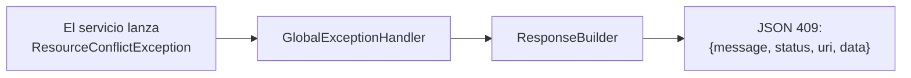

# Infraestructura Compartida

> [!summary]
> Cada endpoint devuelve el **mismo sobre JSON**, y cada error se convierte en ese mismo sobre mediante un único manejador central. Esto significa que el frontend siempre ve una forma predecible, sin importar si la llamada tuvo éxito o falló. Estas piezas viven en el paquete `common/`.

---

## 1. El sobre de respuesta — `GeneralResponse`

Cada respuesta — éxito o error — se ve así:

```json
{
  "uri": "/swift_entry/reservations",
  "message": "Reservation created successfully",
  "status": 201,
  "time": null,
  "data": { ... }
}
```

| Campo | Significado |
|---|---|
| `uri` | La ruta que se llamó |
| `message` | Resumen legible por humanos |
| `status` | Código de estado HTTP (también en el estado HTTP real) |
| `time` | Campo de marca de tiempo (presente en el DTO; actualmente no se llena) |
| `data` | El payload real — un objeto, una lista o `null` |

Fuente: `common/dto/GeneralResponse.java`.

---

## 2. El envoltorio — `ResponseBuilder`

`common/components/ResponseBuilder` es un pequeño `@Component` con un solo método:

```java
buildResponse(String message, HttpStatus status, Object data)
```

Calcula la URI de la petición automáticamente y devuelve un `ResponseEntity<GeneralResponse>`. **Cada controlador inyecta esto y lo usa en lugar de devolver objetos crudos** — por eso las respuestas son consistentes en toda la API. Cuando leas cualquier controlador, verás este patrón repetido.

---

## 3. Excepciones personalizadas

En lugar de devolver códigos de error a mano, los servicios **lanzan** excepciones con significado y dejan que el manejador central las traduzca. Viven en `common/exceptions/`:

| Excepción | Se convierte en HTTP | Se usa cuando |
|---|---|---|
| `ResourceNotFoundException` | `404 Not Found` | Un id/correo no existe |
| `ResourceConflictException` | `409 Conflict` | Duplicado, o choque de regla (ej. asiento ya ocupado, correo ya usado) |
| `ForbiddenOperationException` | `403 Forbidden` | Tienes sesión pero no permiso para esto (ej. cancelar la reserva de otro) |
| `BadRequestException` | `400 Bad Request` | Sintaxis válida pero petición inválida (ej. pagar una reserva expirada) |
| `InvalidTokenException` | `401 Unauthorized` | Token de refresco faltante/expirado/revocado |

Por esto el código de los servicios se lee limpio: solo lanza la excepción correcta con un mensaje, y confía en que la capa de abajo la formatee.

---

## 4. El traductor central de errores — `GlobalExceptionHandler`

`common/handler/GlobalExceptionHandler` es un `@RestControllerAdvice` — una sola clase que atrapa excepciones lanzadas **en cualquier parte** y las convierte en un `GeneralResponse` vía el `ResponseBuilder`. Maneja:

- Todas las excepciones personalizadas de arriba.
- **Fallos de validación** (`MethodArgumentNotValidException`) — recopila cada campo inválido en un mapa `{campo: mensaje}` bajo `data`, devuelto como `400`.
- **JSON mal formado** (`HttpMessageNotReadableException`) → `400`.
- **Fallos de bloqueo optimista** (`OptimisticLockingFailureException`) → `409` con "intenta de nuevo". Esta es la red de seguridad para la condición de carrera al comprar asientos — ver [[Concurrencia y Bloqueo]].
- **Errores de seguridad** — `AccessDeniedException` → `403`, `AuthenticationException` → `401`.
- **Cualquier otra cosa** → un `500` genérico (para que las trazas de error nunca se filtren a los clientes).



> [!tip] Por qué esto importa para el equipo
> Casi nunca necesitas escribir try/catch en un servicio. **Lanza la excepción correcta, escribe un buen mensaje, y para.** El manejador hace el resto, y el cliente siempre recibe el mismo sobre.

---

## 5. Validación

Los DTOs de petición usan **Jakarta Bean Validation** (`@NotNull`, `@NotEmpty`, `@Size`, `@Email`, etc.) y los controladores marcan el cuerpo con `@Valid`. Cuando la validación falla, el `GlobalExceptionHandler` produce un `400` listando cada campo erróneo. Ejemplo: la petición de [[Reserva]] obliga a "1–5 asientos" directo en el DTO.

---

## Ver También
- [[Concurrencia y Bloqueo]] — de dónde viene el camino del `409` de bloqueo optimista
- [[Seguridad y Autenticacion]] — los manejadores de `401`/`403`
- [[Vision General del Sistema]] — dónde encaja esto en las capas
