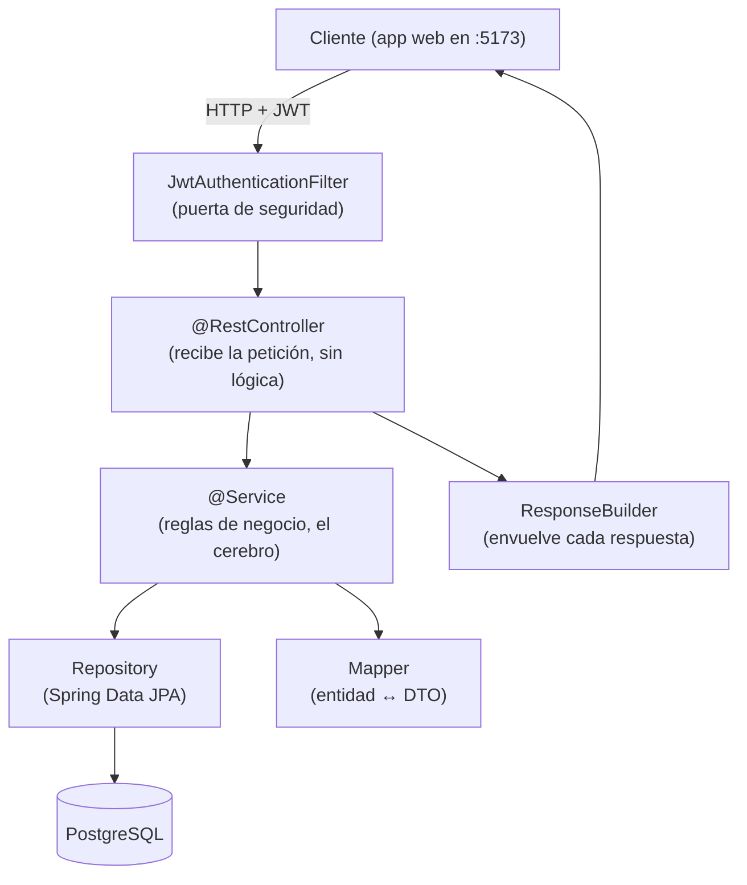

# Visión General del Sistema

> [!summary]
> SwiftEntry es un backend REST por capas. Una petición llega por HTTP, pasa por un **filtro de seguridad**, aterriza en un **controlador**, que llama a un **servicio** (el cerebro), que habla con los **repositorios** (la base de datos) y usa **mappers** para traducir entre los objetos de base de datos y el JSON que ve el mundo exterior. Cada respuesta se envuelve en un único sobre estándar.

---

## 1. Para qué sirve la app

Es el motor de una **plataforma de venta de boletos para eventos**. Las tareas principales:

1. Los **organizadores** crean [[Evento|eventos]] con secciones de precio ([[Localidad|localidades]]) y un [[Asiento|mapa de asientos]].
2. Los **compradores** exploran eventos, eligen asientos y hacen una [[Reserva]] (un apartado de corta duración).
3. Los compradores [[Pago|pagan]]; si todo va bien, el apartado se convierte en una venta confirmada y se emiten [[Boleto|boletos]] (con códigos QR).
4. El **personal** escanea el QR de un boleto en la entrada para validar el acceso.
5. Se pueden solicitar [[Reembolso|reembolsos]] contra un pago (esta área aún se está construyendo).

La versión de principio a fin de esto es la página más útil: [[Flujo de Reserva y Compra]].

---

## 2. Las capas (cómo fluye cualquier petición)

| Capa | Carpeta | Responsabilidad | Analogía |
|---|---|---|---|
| **Controlador** | `controller/` | Recibe la llamada HTTP, la pasa al servicio, envuelve la respuesta. **Sin lógica de negocio.** | El mesero que toma tu orden |
| **Servicio** | `services/` | Todas las reglas y decisiones. La parte que vale la pena estudiar. | La cocina |
| **Repositorio** | `repositories/` | Lee/escribe la base de datos sin SQL escrito a mano (en su mayoría). | La despensa |
| **Modelo (Entidad)** | `*Model.java` | Una clase Java mapeada a una tabla. | Una fila de una tabla |
| **DTO** | `dto/request`, `dto/response` | La forma de los datos que entran y salen como JSON. Oculta la forma de la base de datos. | La descripción del menú vs. la receta real |
| **Mapper** | `utils/` | Convierte Entidad ↔ DTO. | El traductor |

Ver [[Infraestructura Compartida]] para las piezas que reutiliza cada capa.

---

## 3. Por qué existen los DTOs y los mappers (en palabras simples)

El objeto de base de datos (el **Modelo**) a menudo contiene cosas que el mundo exterior no debería ver (como `passwordHash`) o cosas que causarían bucles infinitos si se serializan directamente (objetos que se apuntan entre sí).

Por eso cada entidad tiene:
- Un **RequestDTO** — lo que un cliente *tiene permitido enviar*.
- Un **ResponseDTO** — lo que *elegimos mostrar de vuelta*.
- Un **Mapper** — un pequeño `@Component` con métodos `toModel(...)`, `toResponse(...)` y a veces `updateModel(...)` que copian campos entre ambos.

Esto es consistente en todas las entidades, así que una vez que has leído una ([[Reserva]] es un buen ejemplo), las entiendes todas.

---

## 4. Dónde vive la lógica "inteligente"

La mayoría de las entidades CRUD son simples. El comportamiento interesante está concentrado en tres lugares:

- **[[Reserva]]** — crear un apartado, liberar asientos, expirar apartados viejos, recalcular totales.
- **[[Pago]]** — convertir un apartado en una venta de forma atómica (el `PaymentExecutor`), emitir boletos.
- **[[Asiento]]** — construir la cuadrícula de asientos, asignar asientos a localidades y la vista del mapa de asientos.

El hilo que conecta todo esto — y la seguridad ante concurrencia que mantiene a dos compradores fuera del mismo asiento — se explica en [[Concurrencia y Bloqueo]].

---

## 5. Preocupaciones transversales

- **[[Seguridad y Autenticacion]]** — toda petición (salvo una pequeña lista pública) debe llevar un JWT válido.
- **[[Infraestructura Compartida]]** — el sobre `GeneralResponse`, el `ResponseBuilder`, las excepciones personalizadas y el `GlobalExceptionHandler` que convierte los errores en JSON limpio.
- **Tareas programadas** — un trabajo en segundo plano (`ReservationScheduler`) corre cada minuto para limpiar apartados expirados. Ver [[Reserva]].

---

## 6. Configuración y ejecución

- **Archivo de config:** `src/main/resources/application.yaml`
- **Base de datos:** PostgreSQL; la conexión viene de las variables de entorno `DB_USERNAME`, `DB_PASSWORD`, `DB_URI`.
- **Esquema:** `ddl-auto: update` — Hibernate crea/actualiza las tablas automáticamente a partir de las clases de entidad al arrancar. **No hay herramienta de migración (Flyway/Liquibase).**
- **Ejecutar:** `./mvnw spring-boot:run` · **Compilar:** `./mvnw clean package` · **Pruebas:** `./mvnw test`
- **CORS:** solo se permite `http://localhost:5173` (el frontend local).

> [!warning] Detalle de configuración conocido
> El secreto de firma del JWT está **escrito directo (hardcoded)** en `application.yaml`, y hay un `spring.security.user` sobrante (nombre `mike` / contraseña `holly`) que no se usa. Ambos deberían moverse a variables de entorno / eliminarse antes de cualquier despliegue real. Ver [[Seguridad y Autenticacion]].

---

## Ver También
- [[Inicio]] — índice del vault
- [[Flujo de Reserva y Compra]] — las entidades en movimiento
- [[Concurrencia y Bloqueo]] — el detalle más difícil e importante
