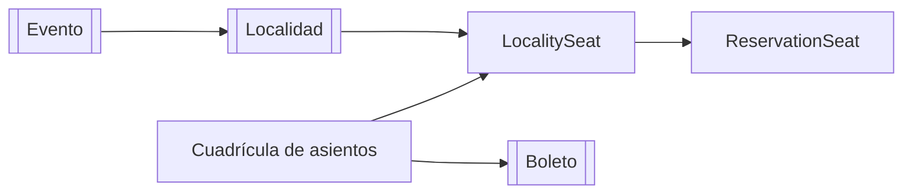

# Asiento

> [!summary]
> "Asiento" en realidad son **dos** ideas. Un **`Seat`** es una posición física en la cuadrícula del recinto (ej. fila A, número 5) que existe independientemente de cualquier evento. Un **`LocalitySeat`** es la *asignación* de ese asiento físico a una [[Localidad]] específica en un [[Evento]] específico — y **su estado (`AVAILABLE`/`RESERVED`/`SOLD`) es la única fuente de verdad** sobre si un asiento está ocupado. Casi todo en el [[Flujo de Reserva y Compra]] gira en torno a la fila `LocalitySeat`.

Paquete: `domain/Seat/`

---

## 1. Modelos

### `SeatModel` (tabla `seats`) — la cuadrícula física
Un asiento reutilizable, independiente del evento. Solo `rowLabel` (A–J) y `seatNumber` (1–16). La cuadrícula por defecto es de **10 filas × 16 columnas = 160 asientos**, creada una vez vía el endpoint de inicialización.

### `LocalitySeatModel` (tabla `locality_seats`) — la asignación + estado en vivo
Este es el importante.

| Campo | Significado |
|---|---|
| `locality` → [[Localidad]] | A qué sección con precio pertenece este asiento (para este evento) |
| `seat` → `SeatModel` | Qué asiento físico |
| `status` | `AVAILABLE` / `RESERVED` / `SOLD` / `BLOCKED` / `DISABLED` |
| `reservedByUser` → [[Usuario]] | Quién lo tiene apartado actualmente (si está reservado) |
| `reservationExpiresAt` | Cuándo caduca el apartado |
| `qrHash` | Reservado para uso futuro de QR |
| `version` (`@Version`) | Bloqueo optimista — ver [[Concurrencia y Bloqueo]] |
| `isActive` | Bandera suave de encendido/apagado |

Una **restricción única** sobre `(seat_id, locality_id)` evita que el mismo asiento físico se asigne dos veces a la misma localidad.

> [!note] La separación mental
> `Seat` = "esta silla existe en el edificio". `LocalitySeat` = "para *este* evento, esta silla está en la sección VIP y actualmente está RESERVED por Ana". El estado vive en el `LocalitySeat`, nunca en el `Seat` pelón.

---

## 2. Servicio — `SeatServiceImpl`

| Método | Qué hace |
|---|---|
| `initializeSeats()` | Crea de forma idempotente la cuadrícula física 10×16 (salta los asientos que ya existen). |
| `assignSeats(req)` | Asigna una lista de asientos (ej. `["A1","B10"]`) a una [[Localidad]]; rechaza duplicados dentro del mismo evento; sube `capacity` y `availableSlots` de la localidad. |
| `getSeatMapByEventId(eventId)` | Devuelve el **mapa visual completo de asientos** de un evento — cada asiento físico, con su localidad + estado si está asignado, o en blanco si no. Ordenado por fila y luego columna. Esto es lo que renderiza el frontend. |
| `getAllSeats()` / `getSeatById(id)` | Leer la cuadrícula física. |
| `getSeatsByLocalityId(id)` | Todas las asignaciones `LocalitySeat` de una localidad. |
| `unassignSeat(localitySeatId)` | Quita una asignación; **bloqueado si tiene reserva**; decrementa `capacity`/`availableSlots`. |
| `deleteSeat(id)` | Borra un asiento físico; **bloqueado si tiene reservas**; cascada a sus asignaciones. |

### El mapa de asientos (cómo se construye)
`getSeatMapByEventId` carga todos los `LocalitySeat` del evento en un `Map<seatId, asignación>`, luego recorre cada asiento físico y emite un `SeatMapResponseDTO` — llenando localidad/estado donde existe una asignación y `null` donde el asiento no se vende en este evento. Así es como la UI muestra todo el recinto con sus huecos.

---

## 3. Controlador

`SeatController` → `/swift_entry/seats`

| Método y ruta | Propósito |
|---|---|
| `POST /seats/initialize` | Construir la cuadrícula física |
| `POST /seats/assign` | Asignar asientos a una localidad |
| `GET /seats/event/{eventId}` | El mapa completo de asientos de un evento |
| `GET /seats` | Todos los asientos físicos |
| `GET /seats/{id}` | Un asiento físico |
| `GET /seats/locality/{localityId}` | Asientos en una localidad |
| `DELETE /seats/assignment/{localitySeatId}` | Desasignar un asiento |
| `DELETE /seats/{id}` | Borrar un asiento físico |

Las rutas `GET` de asientos son públicas; el resto va detrás de autenticación (ver [[Seguridad y Autenticacion]]).

---

## 4. Repositorios

- `SeatRepository` — `findByRowLabelAndSeatNumber` (usado durante la asignación).
- `LocalitySeatRepository` — el repo más activo de la app. Búsquedas por localidad/evento, guardas `existsBy…`, borrados masivos, y crucialmente **`findAllByIdWithLock`** — la consulta `PESSIMISTIC_WRITE` que da poder a las reservas seguras. Ver [[Concurrencia y Bloqueo]].

---

## 5. DTOs y Mapper

- `SeatAssignmentRequestDTO` — localityId + lista de identificadores de asiento.
- `SeatResponseDTO` — un asiento físico.
- `LocalitySeatResponseDTO` — una asignación con su estado.
- `SeatMapResponseDTO` — una celda del mapa visual.
- `SeatMapper` — convierte todo lo anterior.

---

## 6. Relaciones

- Un `Seat` se mapea dentro de una [[Localidad]] como un `LocalitySeat`.
- Un `LocalitySeat` apartado/vendido es referenciado por un [[Reserva|ReservationSeat]].
- Un [[Boleto]] referencia al `Seat` físico directamente.

---

## 7. Notas y Detalles a Tener en Cuenta
- 🔵 El tamaño de la cuadrícula (`ROWS` A–J, `COLUMNS` 16) está **hardcodeado** en `SeatServiceImpl`.
- 🟢 Los borrados/desasignaciones están correctamente **protegidos** contra reservas existentes, evitando reservas huérfanas.
- 🟡 `SeatStatus` incluye `BLOCKED` y `DISABLED`, pero ningún camino de servicio actual los establece — están reservados para uso futuro.

## Ver También
- [[Localidad]] — la sección a la que se asigna un asiento
- [[Reserva]] — cómo se aparta un asiento
- [[Concurrencia y Bloqueo]] — el bloqueo pesimista vive aquí
- [[Flujo de Reserva y Compra]]
