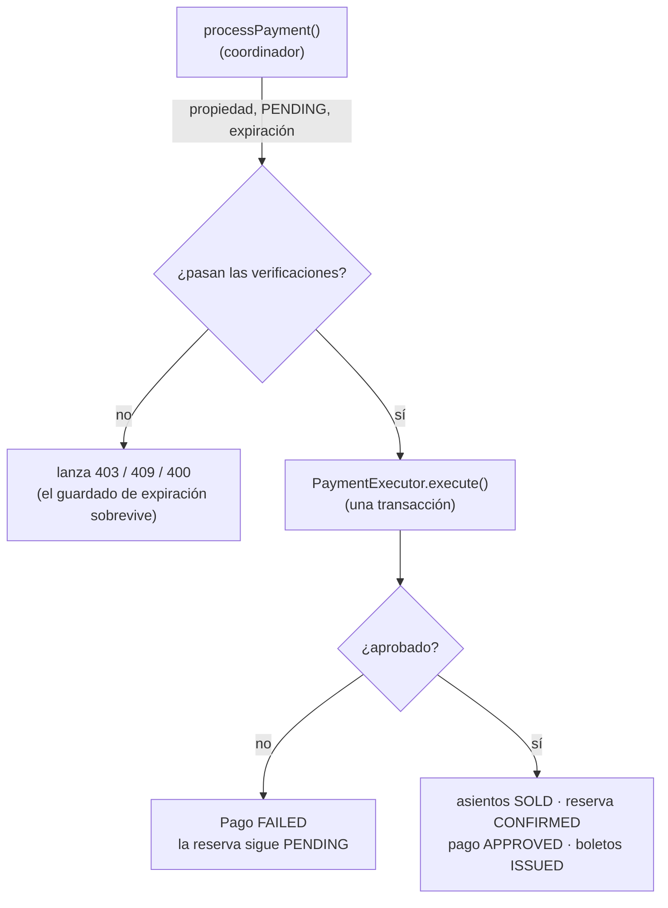

# Pago

> [!summary]
> Un **Pago** cobra al comprador y convierte una [[Reserva]] `PENDING` en una venta confirmada. La parte ingeniosa es que está dividido en **dos beans**: un coordinador (`PaymentServiceImpl`) que hace las verificaciones previas, y un ejecutor atómico (`PaymentExecutor`) que realiza el cambio de todo-o-nada — pasando los asientos a `SOLD`, la reserva a `CONFIRMED`, y emitiendo [[Boleto|boletos]].

Paquete: `domain/Payment/`

---

## 1. Modelo

### `PaymentModel` (tabla `payment`)

| Campo | Significado |
|---|---|
| `reservation` → [[Reserva]] | Lo que se está pagando |
| `amount` | Monto cobrado (copiado del total de la reserva) |
| `paymentMethod` | `CASH` / `CREDIT_CARD` / `DEBIT_CARD` / `BANK_TRANSFER` |
| `status` | `PENDING` / `APPROVED` / `FAILED` / `CANCELLED` |
| `transactionReference` | Un `TXN-<uuid>` generado al tener éxito |
| `paidAt` | Marca de tiempo de la aprobación |

---

## 2. Servicios — y por qué hay dos

### `PaymentServiceImpl` — el coordinador (NO transaccional)
`processPayment(req, userEmail)` corre las **verificaciones previas**:
1. Resolver el [[Usuario]] y la [[Reserva]].
2. **Propiedad** — la reserva debe pertenecer a quien llama, si no `403`.
3. **Pagable** — debe estar `PENDING`, si no `409`.
4. **No expirada** — si pasó de `expiresAt`, márcala `EXPIRED`, **guarda**, y rechaza con `400`.
5. Simula al proveedor (`simulatePaymentProcessing()` actualmente siempre devuelve `true`).
6. Delega a `PaymentExecutor.execute(...)`.

> [!important] ¿Por qué este método NO es `@Transactional` deliberadamente?
> El paso 4 necesita **persistir** el estado `EXPIRED` y *luego* lanzar un error. Si todo el método fuera una sola transacción, lanzar la excepción haría rollback de ese guardado y la expiración se perdería. Al mantener el coordinador sin transacción y poner solo la mutación de éxito dentro de la transacción del ejecutor, la escritura de "marcar expirada y rechazar" sobrevive.

### `PaymentExecutor` — el cambio atómico (`@Transactional`)
`execute(reservationId, req, approved)` es un `@Component` aparte para que el proxy de Spring realmente aplique la frontera transaccional (las auto-llamadas no pasan por el proxy). Dentro de la única transacción:

1. **Re-verifica** `PENDING` y no-expirada — cerrando la ventana de carrera entre la verificación externa y el commit (ver [[Concurrencia y Bloqueo]]).
2. Construye el `PaymentModel`.
3. **Si se rechaza:** estado `FAILED`, guarda, devuelve — la reserva **sigue `PENDING`** para que el comprador reintente.
4. **Si se aprueba (todo en una transacción):**
   - Pago → `APPROVED`, fija `paidAt` y `TXN-<uuid>`.
   - Reserva → `CONFIRMED`, fija `purchasedAt`.
   - Cada [[Asiento|LocalitySeat]] apartado → `SOLD`, limpiando sus campos de apartado.
   - Crea un [[Boleto]] por asiento (`TKT-<uuid>`, `QR-<uuid>`, `ISSUED`).
   - Guarda asientos, reserva, pago y boletos.

### Método de lectura
- `getMyPayments(email)` — todos los pagos que pertenecen a quien llama (`findByReservation_User_Email`).

---

## 3. Controlador

`PaymentController` → `/swift_entry/payments`

| Método y ruta | Propósito | Acceso |
|---|---|---|
| `POST /payments` | Pagar una reserva | Autenticado |
| `GET /payments/me` | Mis pagos | Autenticado |

---

## 4. Repositorio

`PaymentRepository` — `findByReservationId`, `findByStatus`, `findByTransactionReference`, `existsByReservationIdAndStatus`, y `findByReservation_User_Email` (usado por `getMyPayments`).

---

## 5. DTOs y Mapper

- `PaymentRequestDTO` — `reservationId` + `paymentMethod`.
- `PaymentResponseDTO` — campos del pago; al tener éxito el mapper también adjunta los [[Boleto|boletos]] emitidos.
- `PaymentMapper` — `toModel(...)` y dos variantes de `toResponse(...)` (con/sin boletos).

---

## 6. Relaciones
- Un pago pertenece a exactamente una [[Reserva]].
- Un pago exitoso hace que existan [[Boleto|boletos]] y que los [[Asiento|LocalitySeats]] pasen a `SOLD`.
- Un [[Reembolso]] (en construcción) apuntaría de vuelta a un pago.

---

## 7. Notas y Detalles a Tener en Cuenta
- 🟡 **El proveedor está simulado** — `simulatePaymentProcessing()` siempre devuelve `true`. No hay ninguna pasarela real integrada. La rama `FAILED` existe pero actualmente es inalcanzable en la práctica.
- 🟢 La **división en dos beans** es intencional y crítica — no fusiones `PaymentExecutor` de vuelta en `PaymentServiceImpl`, o se rompen la frontera transaccional y el comportamiento del guardado de expiración.
- 🔵 `PaymentExecutor` está anotado como `@Component` (no `@Service`) pero funcionalmente es un bean de servicio.

## Ver También
- [[Flujo de Reserva y Compra]] · [[Reserva]] · [[Boleto]]
- [[Concurrencia y Bloqueo]] — las re-verificaciones internas y por qué importan
