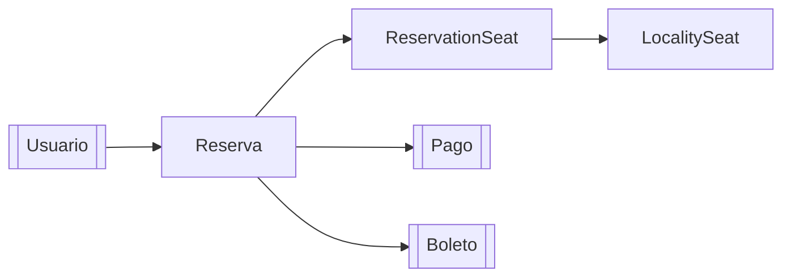

# Reserva

> [!summary]
> Una **Reserva** es un apartado temporal de uno o más asientos mientras un comprador decide y paga. Es el corazón del [[Flujo de Reserva y Compra]]. Una reserva empieza `PENDING` con un temporizador de 15 minutos; pasa a `CONFIRMED` una vez [[Pago|pagada]], o a `CANCELLED`/`EXPIRED` en otro caso. Cada asiento apartado se registra como una línea **ReservationSeat** con su precio congelado al momento de reservar.

Paquete: `domain/Reservation/`

---

## 1. Modelos

### `ReservationModel` (tabla `reservation`)
El apartado en sí.

| Campo | Significado |
|---|---|
| `user` → [[Usuario]] | Quién está comprando |
| `reservationSeats` | La lista de líneas de asiento (una por asiento apartado) |
| `status` | `PENDING` / `CONFIRMED` / `EXPIRED` / `CANCELLED` / `REFUNDED` |
| `subtotal`, `taxAmount`, `discountAmount`, `totalAmount` | El desglose del dinero (13% de impuesto) |
| `reservedAt`, `purchasedAt`, `expiresAt` | Tiempos — `expiresAt` es 15 min después de la creación |

### `ReservationSeatModel` (tabla `reservation_seats`)
Una entidad de unión/línea que liga una reserva a un [[Asiento|LocalitySeat]].

| Campo | Significado |
|---|---|
| `reservation` | El apartado padre |
| `localitySeat` → [[Asiento\|LocalitySeat]] | El asiento específico que se aparta |
| `priceAtReservation` | **Foto** del precio al momento de reservar (para que cambios de precio posteriores no alteren un apartado existente) |

> [!note] ¿Por qué congelar el precio?
> Si un organizador cambia el precio de una [[Localidad]] después de que reservaste, tu total no debería cambiar en silencio. Congelar `priceAtReservation` mantiene estable la matemática de cada apartado.

---

## 2. Servicios — el cerebro

`ReservationServiceImp` (ojo: escrito `…Imp`) es uno de los servicios más importantes de la app.

| Método | Qué hace |
|---|---|
| `createReservation(req, userEmail)` | Hace un apartado. **Bloquea** los asientos, valida disponibilidad + mismo-evento, calcula totales, pasa asientos a `RESERVED`, decrementa `availableSlots`. Ver [[Concurrencia y Bloqueo]]. |
| `getAllReservations()` | Admin: todas las reservas. |
| `getReservationById(id)` | Admin: una reserva. |
| `getMyReservations(email)` | Las reservas propias de un usuario. |
| `getReservationsByOrganizer(email)` | Todas las reservas de los eventos que posee este organizador (consulta join personalizada). |
| `cancelReservation(id, email)` | El dueño cancela un apartado `PENDING`; libera asientos, estado → `CANCELLED`. |
| `removeSeatFromReservation(resId, seatId, email)` | Quita un asiento de un apartado `PENDING`, lo libera, **recalcula totales**; auto-cancela si era el último asiento. |
| `expirePendingReservations()` | Libera asientos de todos los apartados `PENDING` expirados y los marca `EXPIRED`. Lo llama el scheduler. |

### Constantes clave
```java
MAX_SEATS_PER_RESERVATION = 5
RESERVATION_EXPIRY_MINUTES = 15
TAX_RATE = 0.13   // 13%
```

### El helper compartido `releaseSeats(...)`
Cancelar y expirar necesitan ambos "devolver asientos". Este método privado pasa cada `LocalitySeat` a `AVAILABLE`, limpia su `reservedByUser`/expiración, y restaura el `availableSlots` de cada localidad — acumulando primero los deltas por localidad para que los contadores queden correctos incluso con asientos repartidos en varias localidades. Es la contraparte del decremento que hace `createReservation`.

---

## 3. El conserje de expiración — `ReservationScheduler`

`scheduler/ReservationScheduler` es un `@Component` con un método `@Scheduled(fixedDelay = 60_000)` que corre **cada 60 segundos**, llama a `expirePendingReservations()`, y registra cuántos apartados limpió. Esto es lo que evita que apartados abandonados bloqueen asientos para siempre. Ver [[Concurrencia y Bloqueo]].

---

## 4. Controlador

`ReservationController` → ruta base `/swift_entry/reservations`

| Método y ruta | Propósito | Acceso |
|---|---|---|
| `POST /reservations` | Crear un apartado para el usuario con sesión | Autenticado |
| `GET /reservations` | Todas las reservas | **Admin** |
| `GET /reservations/me` | Mis reservas | Autenticado |
| `GET /reservations/organizer` | Reservas de mis eventos | Autenticado (organizador) |
| `GET /reservations/{id}` | Una reserva | **Admin** |
| `DELETE /reservations/{id}` | Cancelar mi apartado | Autenticado (propiedad verificada en el servicio) |
| `DELETE /reservations/{reservationId}/seats/{reservationSeatId}` | Quitar un asiento de un apartado | Autenticado |

El correo del usuario con sesión viene de `authentication.getName()`; el servicio lo resuelve a un [[Usuario]]. Los niveles de acceso se aplican en [[Seguridad y Autenticacion|SecurityRoutes]].

---

## 5. Repositorios

- `ReservationRepository` — además de lo básico: `findByUser_Id`, `findByIdAndUser_Id` (propiedad), y dos joins `@Query` personalizados: `findExpiredReservations` (con `JOIN FETCH` para evitar N+1) y `findByOrganizerOfEvent`.
- `ReservationSeatRepository` — muchos chequeos `existsBy…` usados por los servicios de [[Evento]], [[Localidad]] y [[Asiento]] para bloquear borrados cuando un asiento tiene reservas.

---

## 6. DTOs y Mapper

- `ReservationRequestDTO` — solo `localitySeatIds` (validado **1–5** vía `@NotEmpty` + `@Size`).
- `ReservationResponseDTO` — desglose completo incl. info del usuario, dinero, fechas y las líneas de asiento anidadas.
- `ReservationMapper` / `ReservationSeatMapper` — construyen el modelo y lo aplanan a DTOs de respuesta.

---

## 7. Relaciones



- Una reserva pertenece a un [[Usuario]].
- Tiene muchas líneas `ReservationSeat`, cada una apuntando a un [[Asiento|LocalitySeat]].
- Tras el pago obtiene un [[Pago]] y un conjunto de [[Boleto|boletos]].

---

## 8. Notas y Detalles a Tener en Cuenta
- 🟡 `ReservationSeatService` es **solo una interfaz** — todavía no hay implementación ni controlador para ella.
- 🟢 `createReservation` y los métodos de liberar/expirar son `@Transactional`, lo cual es esencial para que los cambios de estado de asiento + contador sean atómicos.
- 🔵 El nombre de clase es `ReservationServiceImp` (le falta la `l` final) — intencional o no, ese es el nombre real.

## Ver También
- [[Flujo de Reserva y Compra]] — la historia de principio a fin
- [[Pago]] — lo que convierte un apartado en venta
- [[Asiento]] — las filas `LocalitySeat` que se apartan
- [[Concurrencia y Bloqueo]] — el bloqueo que hace seguros los apartados
