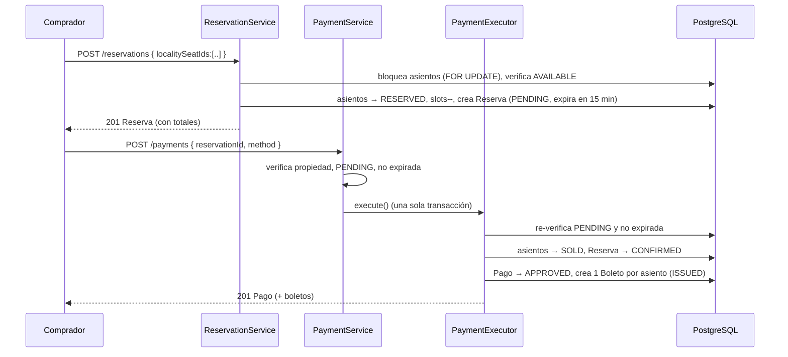

# Flujo de Reserva y Compra

> [!summary]
> Esta es la columna vertebral de toda la aplicación — cómo un comprador pasa de "quiero estos asientos" a "tengo boletos con QR". Conecta [[Reserva]], [[Asiento]], [[Localidad]], [[Pago]] y [[Boleto]]. Si solo lees una página sobre cómo se *comporta* SwiftEntry, lee esta.

---

## 1. La historia en palabras simples

1. Un organizador ya publicó un [[Evento]] con [[Localidad|localidades]] (secciones con precio) y asignó [[Asiento|asientos]] a ellas.
2. Un comprador abre el **mapa de asientos**, elige de 1 a 5 asientos y hace una **[[Reserva]]** — un apartado de 15 minutos. Los asientos pasan de `AVAILABLE` a `RESERVED`.
3. El comprador **[[Pago|paga]]**. Al aprobarse, el apartado se vuelve una venta confirmada, los asientos pasan a `SOLD`, y se genera un **[[Boleto]]** por asiento con un código QR.
4. Si el comprador nunca paga, un conserje en segundo plano libera los asientos tras 15 minutos y marca la reserva como `EXPIRED`.
5. En el lugar del evento, el personal escanea el QR de un boleto; este pasa de `ISSUED` a `USED`.

---

## 2. Los estados por los que pasa cada cosa

| Cosa | Ciclo de vida |
|---|---|
| Estado de [[Asiento\|LocalitySeat]] | `AVAILABLE` → `RESERVED` → `SOLD` (o de vuelta a `AVAILABLE` si se libera) |
| Estado de [[Reserva]] | `PENDING` → `CONFIRMED` (pagado) / `EXPIRED` / `CANCELLED` |
| Estado de [[Pago]] | `PENDING` → `APPROVED` / `FAILED` |
| Estado de [[Boleto]] | `ISSUED` → `USED` (escaneado en la entrada) |

Los tres estados se mantienen sincronizados porque los cambios ocurren **juntos, en una sola transacción** — ver [[Concurrencia y Bloqueo]].

---

## 3. El camino feliz, paso a paso

### 3a. Hacer el apartado — `ReservationServiceImp.createReservation`
- Rechaza más de **5 asientos** a la vez.
- **Bloquea** las filas de asientos pedidas para que nadie más pueda tomarlas concurrentemente.
- Verifica que cada asiento esté `AVAILABLE` **y pertenezca al mismo [[Evento]]** (no se mezclan eventos en una reserva).
- Calcula el dinero: `subtotal` = suma de precios de localidad, `tax` = **13%** (`TAX_RATE`), `total` = subtotal + impuesto − descuento.
- Crea la `Reservation` (`PENDING`) más una línea `ReservationSeat` por asiento, congelando el precio al momento de reservar.
- Pasa los asientos a `RESERVED`, fija una expiración de 15 minutos, y decrementa el `availableSlots` de cada localidad.

### 3b. Pagar — `PaymentServiceImpl.processPayment` + `PaymentExecutor.execute`
- Confirma que la reserva **pertenece a quien llama** (si no, `403`).
- Confirma que siga `PENDING` (si no, `409`) y **no expirada** (si no, se marca `EXPIRED` y se rechaza con `400`).
- Pasa el control a `PaymentExecutor`, el bean **transaccional** que hace el cambio atómico: re-verifica las reglas, luego pone los asientos en `SOLD`, la reserva en `CONFIRMED`, el pago en `APPROVED` (con una referencia `TXN-…`), y emite un [[Boleto]] (código `TKT-…` + código `QR-…`) por cada asiento.
- ¿Por qué dos beans? Para que el camino de "marcar como EXPIRED y rechazar" pueda hacer **commit** antes de lanzar la excepción, mientras que el camino de éxito permanece totalmente atómico. Razonamiento completo en [[Pago]].

---

## 4. Los caminos no felices (todos manejados)

| Qué pasa | Resultado |
|---|---|
| El comprador elige un asiento que otro acaba de tomar | `409 Conflict` (atrapado en la verificación del bloqueo) |
| El comprador espera >15 min, luego paga | Reserva marcada `EXPIRED`, pago rechazado `400` |
| El comprador nunca regresa | `ReservationScheduler` (cada 60s) libera asientos, marca `EXPIRED` |
| El comprador cancela un apartado `PENDING` | Asientos liberados a `AVAILABLE`, reserva `CANCELLED` |
| El comprador quita un asiento de un apartado de varios | Ese asiento se libera, se recalculan totales; si era el último, toda la reserva se auto-`CANCELLED` |
| El proveedor de pago rechaza | Pago registrado `FAILED`, la reserva **sigue `PENDING`** para que el comprador reintente |
| Dos pagos compiten por asientos que se traslapan | Bloqueo optimista `@Version` → `409`, reintentar |

---

## 5. Quién es dueño de cada paso

- **[[Reserva]]** — apartados, liberaciones, expiración, recálculo de totales.
- **[[Pago]]** — la conversión atómica "apartado → venta" y la creación de boletos.
- **[[Boleto]]** — el comprobante con QR y su validación posterior en la entrada.
- **[[Asiento]]** — la fila `LocalitySeat` alrededor de la cual gira todo esto.

## Ver También
- [[Concurrencia y Bloqueo]] — por qué nada de esto vende un asiento dos veces
- [[Vision General del Sistema]] — dónde encajan estos servicios en las capas
- [[Inicio]]
