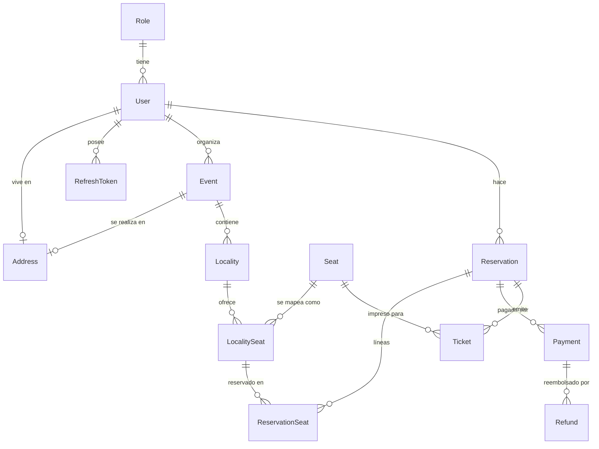

# Backend de SwiftEntry — Vault de Documentación

> [!info] Cómo leer esta documentación
> Esta carpeta es un **vault de Obsidian** autocontenido. Abre la carpeta `docs/` en Obsidian y cada `[[enlace]]` se vuelve clicable. Empieza aquí y luego sigue los enlaces hacia el área que te interese. Las páginas están escritas para entenderse sin necesidad de un conocimiento profundo de Java/Spring primero, con el detalle técnico debajo.

SwiftEntry es el **backend de una plataforma de venta de boletos para eventos** — piensa en un sistema que permite a los organizadores publicar eventos, y a las personas elegir asientos en un mapa, apartarlos, pagar y recibir boletos con código QR que se escanean en la entrada.

Es una **API REST con Spring Boot 4 / Java 21** respaldada por **PostgreSQL** y protegida con **JWT**. Todas las rutas viven bajo el prefijo base `/swift_entry/`.

---

## Empieza aquí

- [[Vision General del Sistema]] — el panorama completo: qué hace la app, cómo fluye una petición y el mapa de todas las piezas en movimiento.
- [[Flujo de Reserva y Compra]] — la historia más importante: cómo una persona pasa de "quiero estos asientos" a "tengo mis boletos". Aquí es donde la mayoría de las entidades trabajan juntas.

## Arquitectura

- [[Seguridad y Autenticacion]] — inicio de sesión, tokens JWT, tokens de refresco, quién puede acceder a qué.
- [[Infraestructura Compartida]] — las piezas que toda entidad reutiliza: el sobre de respuesta estándar, el manejador global de errores, las excepciones personalizadas.
- [[Concurrencia y Bloqueo]] — cómo la app evita que dos personas compren el mismo asiento al mismo tiempo. **Lee esto para entender la parte más delicada del código.**

## Entidades (una página por cada una)

Cada página de entidad documenta su **Modelo · Servicios · Controlador · Repositorio · DTOs/Mappers · Enums · Relaciones**.

| Entidad | Rol en una línea |
|---|---|
| [[Usuario]] | Una persona que usa el sistema (comprador, organizador o administrador). |
| [[Rol]] | El "puesto" que tiene un usuario — controla los permisos. |
| [[Direccion]] | Una dirección postal reutilizable, ligada a usuarios y eventos. |
| [[Evento]] | Algo para lo que la gente compra boletos (un concierto, un partido…). |
| [[Localidad]] | Una sección con precio dentro de un evento (ej. "VIP", "General"). |
| [[Asiento]] | La cuadrícula física de asientos y cómo se asignan a las localidades. |
| [[Reserva]] | Un apartado temporal de asientos mientras el comprador decide/paga. |
| [[Pago]] | Cobrar al comprador y convertir una reserva en una venta confirmada. |
| [[Boleto]] | El comprobante de entrada con código QR creado tras el pago. |
| [[Reembolso]] | Devolver el dinero (actualmente un área parcial / en construcción). |

---

## Todo el sistema de un vistazo

> [!tip] Modelo mental
> **Evento → Localidad → LocalitySeat** es el lado de "qué está a la venta".
> **Reserva → Pago → Boleto** es el lado de "alguien lo está comprando".
> Se encuentran en el [[Asiento|LocalitySeat]], que es la fila cuyo estado (`AVAILABLE → RESERVED → SOLD`) es la fuente de verdad sobre si un asiento está ocupado.

---

## Tecnología y convenciones

- **Stack:** Spring Boot 4, Java 21, Spring Data JPA / Hibernate, Spring Security, PostgreSQL, Lombok, JJWT.
- **Raíz del paquete:** `com.gerardo.swiftentrybackend`
- **Dos áreas de alto nivel:** `domain/` (una carpeta por entidad) y `security/` + `config/` + `common/` (preocupaciones transversales).
- **Cada carpeta de dominio** sigue el mismo layout: `Model · controller · service · repositories · dto/{request,response} · utils (mapper) · enums`.
- **Cada respuesta HTTP** se envuelve en el mismo sobre — ver [[Infraestructura Compartida]].
- **El esquema lo genera automáticamente** Hibernate (`ddl-auto: update`) — todavía no hay herramienta de migraciones.

> [!warning] Estado del código
> Este es un proyecto universitario en evolución activa. Algunas áreas son esbozos o están a medio conectar (ej. [[Reembolso]] no tiene implementación, el endpoint de crear de [[Localidad]] no hace nada). Cada página de entidad señala esto bajo **Notas y Detalles a Tener en Cuenta** para que el equipo no se lleve sorpresas.
